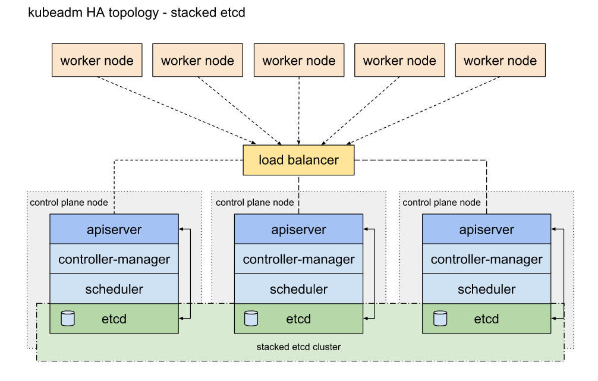
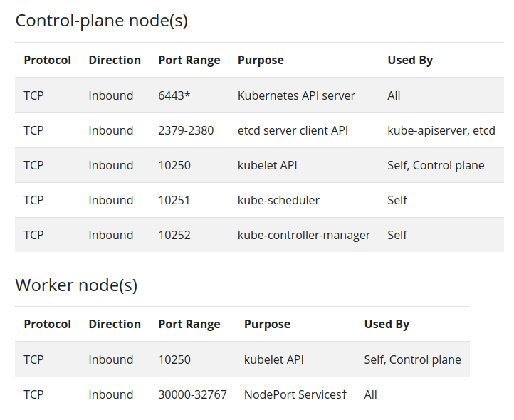
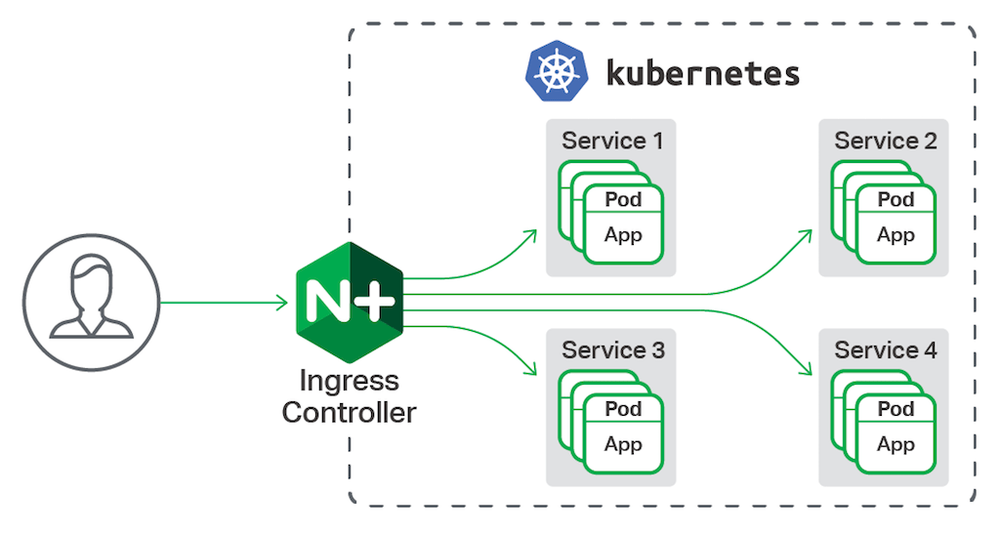

# Kubernetes + 18 - Subindo um cluster do zero

## Arquitetura proposta



pré req: load balancer para api server e ingress

## haproxy

O que é:

Balanceador de carga tcp e http.

[Site](http://www.haproxy.org/) oficial (Parou nos anos 90, eu sei)

### instalando haproxy

```bash
apt update && apt upgrade -y && apt install haproxy -y
```

verificar se o serviço está ok

```bash
systemctl status haproxy
```

configurar e copiar haproxy.cfg em haproxy/haproxy_template.cfg para o servidor em /etc/haproxy/haproxy.cfg
Para isso, é preciso saber os ips dos masters e workers da arquitetura proposta

validar se a config do haproxy está ok

```bash
haproxy -c -V -f /etc/haproxy/haproxy.cfg
```

Recarregar o serviço

```bash
systemctl reload haproxy
```

É possível acessar a interface gráfica do haproxy em

<IP DO LOAD BALANCE>/haproxy?stats

Comunicação entre workers e load balancer



## k8s cluster

### instalando o cluster

Execute o script.sh em cada nó do cluster, seja master ou worker. Este script basicamente faz:

TASK 1: Desabilita permanentemente SWAP para o sistema operacional

A documentação oficial exige que o swap fique desligado nos nós por conta de desempenho
e estabilidade, devido a troca de memória entre ram X disco

TASK 2 Desativando o firewall 

Desativa o firewall que pode vir ativado de uma instalação padrão

TASK 3: Habilita alguns modulos no kernel

br_netfilter: Este módulo é necessário para habilitar o mascaramento transparente e facilitar o tráfego de LAN Extensível Virtual (VxLAN) para comunicação entre pods do Kubernetes no cluster

overlay: É storage driver, responsável pela gravação de dados na layer de escrita

TASK 4: Tunning no kernel

Trata de ajustes para encaminhamento de pacotes e para visualização de tráfego em interfaces
bridge pelo iptables

TASK 5: Instala containerd runtime

Software responsável por executar containers

TASK 6: Adiciona repositório do k8s

Adiciona o repositório necessário para download dos pacotes

TASK 7: Instala os componentes do Kubernetes (kubeadm, kubelet and kubectl)

kubeadm: bootstrap do cluster, tarefas administrativas (reset, join, gerenciar certificados)
kubelet: É como se fosse um agent executado em todos os nós do cluster
kubectl: client, utilitário para interagir com o cluster k8s

verificando se o lb está ok a partir de algum master / worker para inicializar o cluster

```bash
nc -v <IP DO LOAD BALANCER> 6443
```

Depois de atender todos os préreqs, vamos inicializar o cluster, começando pelo control plane. Para isso, execute em um dos masters:

```bash
kubeadm init --control-plane-endpoint 172.31.10.125:6443 --upload-certs
```

Agora que o cluster foi inicializado, precisamos de algo para viabilizar a comunicação entre o cluster, é aqui que entra a cni

(container network interface) e serve basicamente para prover conectividade para containers. Iremos utilizar a cni
da [weave](https://www.weave.works/docs/net/latest/kubernetes/kube-addon/)

```bash
kubectl apply -f "https://cloud.weave.works/k8s/net?k8s-version=$(kubectl version | base64 | tr -d '\n')"
```

joins

Temos tudo pronto para embarcar nossos masters e workers no cluster, o output do bootstrap nos retorna os comandos necessários para tal,
esse output é dividido em 2 tipos de joins: masters e workers

validar a interface do haproxy
<IP DO LOAD BALANCE>/haproxy?stats

Execute o comando de join nos masters 

Execute o comando de join nos workers

Validando se está tudo ok, os nós devem estar como READY e deve ter pods do weave rodando no namespace kube-system

```bash
kubectl get nodes
kubectl get pods -n kube-system
```

## anatomia k8s


* control plane

Uma série de componentes que gerencia o cluster como um todo. Escalonamento em pods, reṕlicas em um deployment.

* kube-apiserver

Frontend do control plane

* etcd

Banco de dados chave / valor que armazena todos as informações do cluster

* kube-scheduler

É responsável por alocar um nó para determinado workload. Pode se basear em alguns críterios como, labels, afinidade, anti afinidade, cpu e memoria.

* kube-controller-manager

Responsável por executar os processos:

- node controller
- replication controller
- endpoints controllers
- service account e token controllers

* cloud-controller-manager

Responsável por fazer proxy com api's de cloud providers.

* kubelet

Agent instalado em cada nó. Responsável por executar o(s) containers dentro de um pod.

* kube-proxy

É executado em cada nó e é responsável pela comunicação dentro do cluster. Cria regras de firewall 
utilizando netfilter (iptables).

* Container runtime

responsável por executar os containers.

* kubectl

CLI do Kubernetes, kubectl, permite que você execute comandos em clusters. Você pode usar kubectl para implantar aplicativos, inspecionar e gerenciar recursos de cluster e ver logs.

## objetos

Entidades persistentes dentro de um cluster.

* namespace

* daemonset

* deployment

* replicaset

* statefulset

* services

* ingress

* pod

Esses objetos são aplicados no cluster basicamente de duas maneiras

* imperativa
* declarativa

Imperativa é a execução do comando "on the fly" usando kubectl
Declarativa utiliza arquivos .yaml para aplicar o estado desejável de determinado objeto dentro do cluster

## Pods

Os pods são as menores unidades de computação implantáveis que você pode criar e gerenciar no Kubernetes.

Um pod (como em um pod de baleias) é um grupo de um ou mais contêineres, com armazenamento / recursos de rede compartilhados e uma especificação de como executar os contêineres.

## Workload

## ingress

Agora que temos um cluster k8s apto para utilização, com alta disponibilidade, vamos executar carga de trabalho nele.

O que é

Ingress é basicamente um recurso que fornece acesso externo aos services em um cluster, geralmente em http

Também pode fornecer balanceamento de carga, terminação SSL e hospedagem virtual baseada em nome



[Nginx ingress](https://kubernetes.github.io/ingress-nginx/)


```bash
kubectl apply -f https://raw.githubusercontent.com/kubernetes/ingress-nginx/controller-v0.47.0/deploy/static/provider/baremetal/deploy.yaml
```

para validar

```bash
kubectl get pods -n ingress-nginx \
  -l app.kubernetes.io/name=ingress-nginx --watch
```

Adicione a porta do nodeport ao balanceamento dos workers no haproxy, para obter a porta http, execute

```bash
kubectl describe svc ingress-nginx-controller -n ingress-nginx
```


Efetue clone do repo

```bash
git clone https://github.com/rmnobarra/kubernetes-18.git
```

Entre no diretório yamls

```bash
cd kubernetes-18/yamls/
``` 

Execute os Deployments
```bash
kubectl apply -f nginx-deployment-blue.yaml -n ingress-nginx -f nginx-deployment-pink.yaml -n ingress-nginx
```

Criando os services

```bash
kubectl expose deployment nginx-deploy-blue --port 80 -n ingress-nginx
kubectl expose deployment nginx-deploy-pink --port 80 -n ingress-nginx
```

Crie o ingress
```bash
kubectl apply -f ingress.yaml -n ingress-nginx
```

Altere o hosts da estação para o nginx.ot.io + ip externo do load balance

Teste os acessos em

nginx.ot.io/blue e nginx.ot.io/pink

## Recomendações

Livro: [DevOps Nativo de Nuvem com Kubernetes](https://www.amazon.com.br/Kubernetes-Construir-Implantar-Aplica%C3%A7%C3%B5es-Modernas/dp/8575227785/ref=asc_df_8575227785/?tag=googleshopp00-20&linkCode=df0&hvadid=379773616949&hvpos=&hvnetw=g&hvrand=1017342628928426789&hvpone=&hvptwo=&hvqmt=&hvdev=c&hvdvcmdl=&hvlocint=&hvlocphy=1001731&hvtargid=pla-809188252536&psc=1)

Canal: [Justme and opensource](https://www.youtube.com/channel/UC6VkhPuCCwR_kG0GExjoozg)

## Referências:

https://kubernetes.io/docs/setup/production-environment/tools/kubeadm/high-availability/

https://kubernetes.io/docs/setup/production-environment/tools/kubeadm/install-kubeadm/


